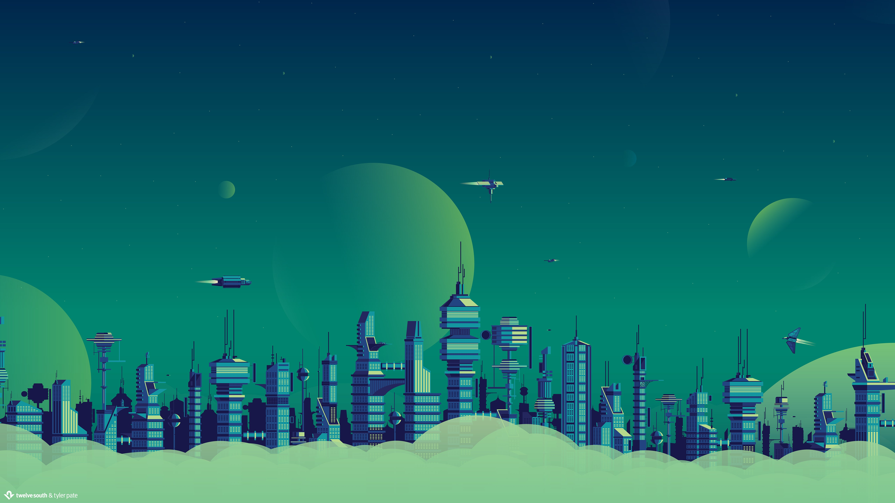
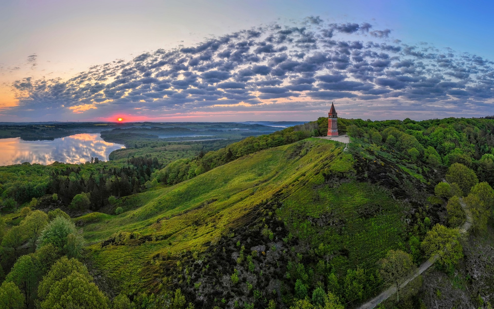
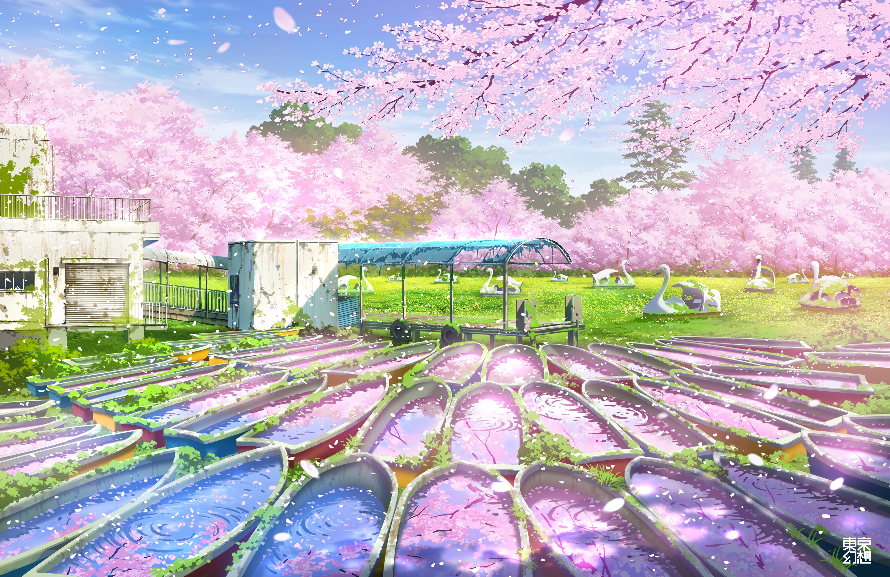
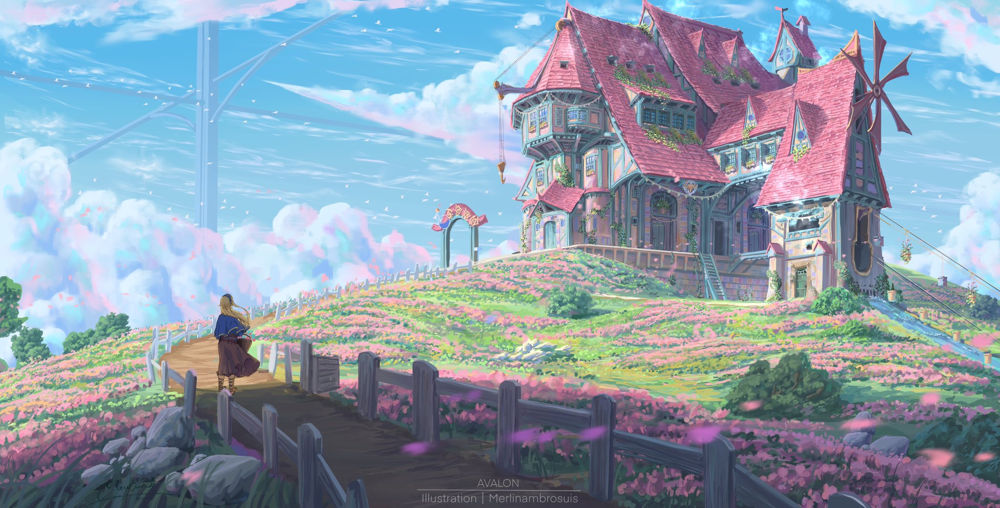
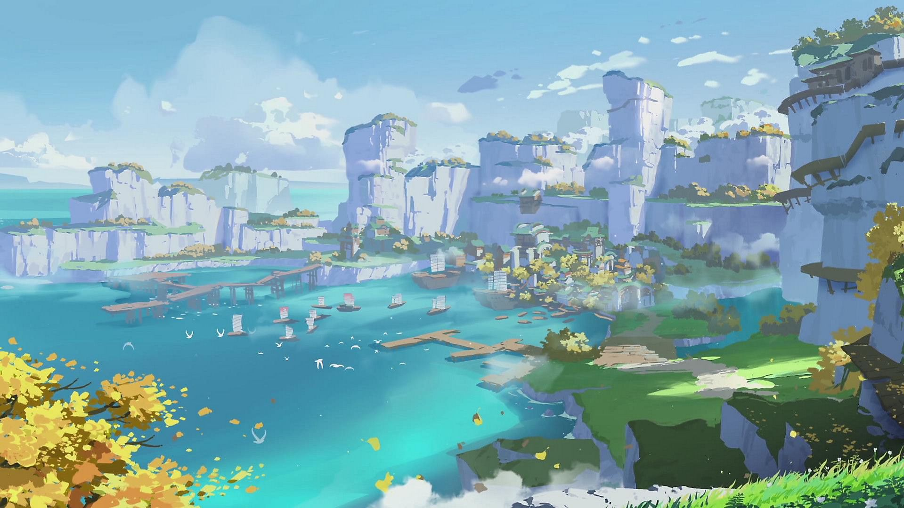
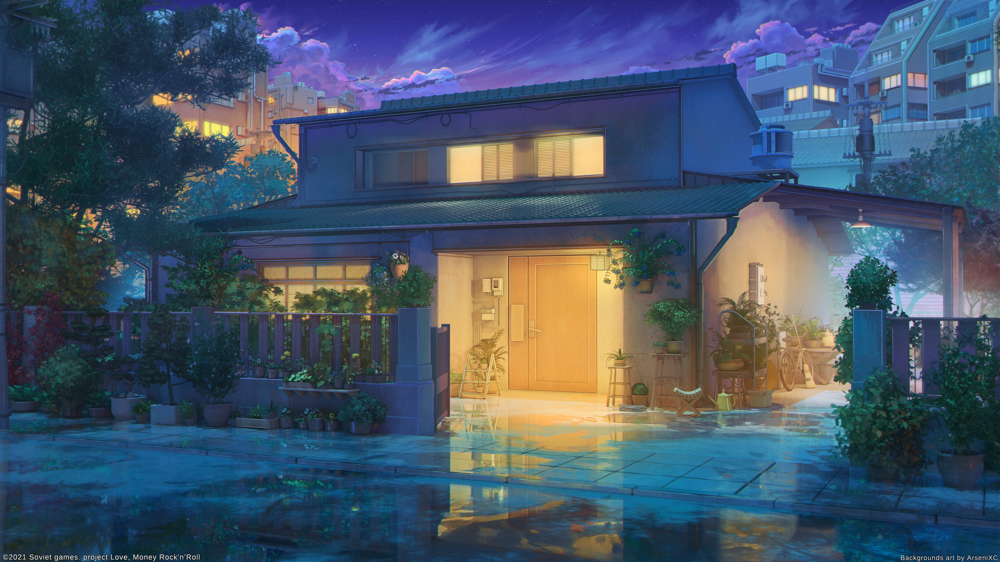
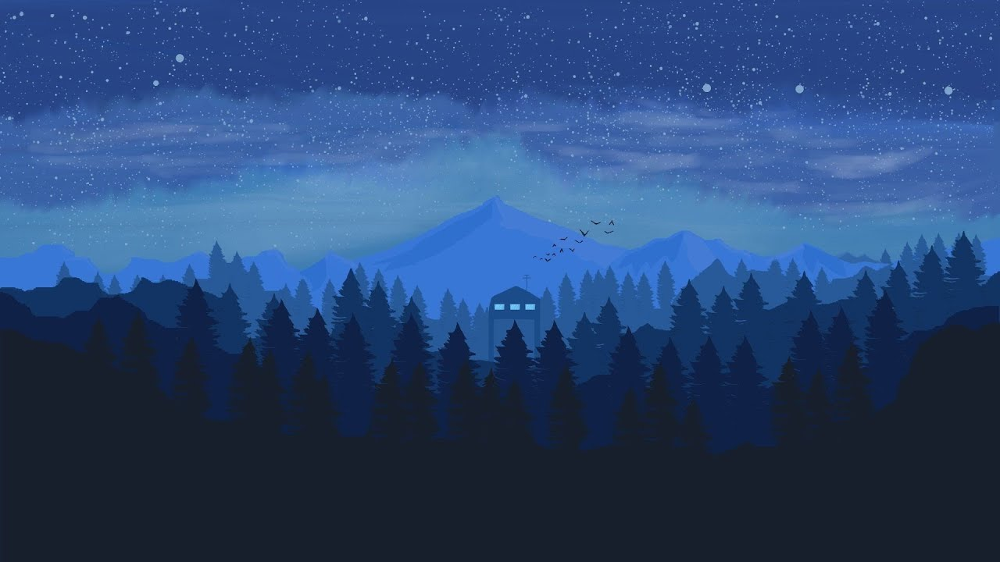
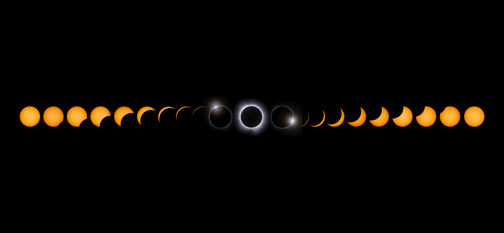
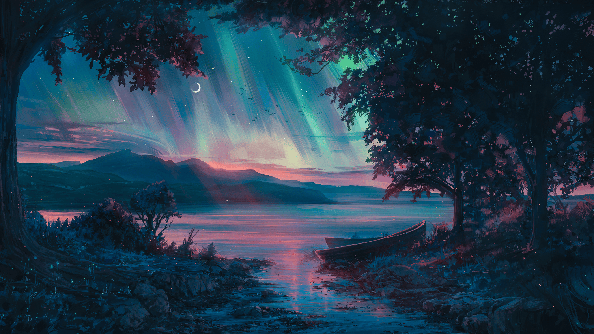
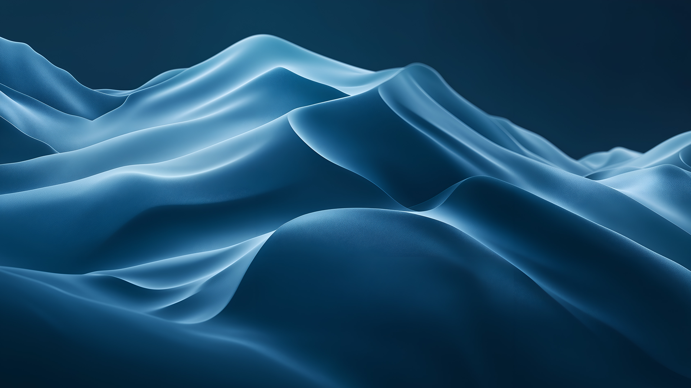

# Wallpapers_Paradise
This is a special repository that user can find wallpapers for their rices

If you want to find it yourself:
https://wallpapers.com/
https://wallscloud.net/en
https://wallhaven.cc/
https://alphacoders.com/space-wallpapers

And the other one repo:
https://github.com/JaKooLit/Wallpaper-Bank

Preview:

## Gallery

Below is the recommended format for adding wallpapers to this repository. Each entry shows a small preview, the image name, the author, and a link (either to the original source or to the file in this repo).

| Preview | Name | Author | Link |
|---:|:---|:---|:---|
|  | wallhaven-o5k7kl | Unknown | [Repo link](wallpapers/urban/wallhaven-o5k7kl.jpg) |
|  | wallhaven-5yd6d5 | Unknown | [Repo link](wallpapers/urban/wallhaven-5yd6d5.png) |
|  | wallhaven-qr27rq | Unknown | [Repo link](wallpapers/real/wallhaven-qr27rq.jpg) |
|  | wallhaven-yq8k2d | Unknown | [Repo link](wallpapers/day/wallhaven-yq8k2d.png) |
|  | wallhaven-po2vg3 | Unknown | [Repo link](wallpapers/day/wallhaven-po2vg3.jpg) |
|  | wallhaven-d8gygl | Unknown | [Repo link](wallpapers/day/wallhaven-d8gygl.png) |
|  | wallhaven-d69eom | Unknown | [Repo link](wallpapers/day/wallhaven-d69eom.jpg) |
|  | 5e83255d8a1f9c87b271ad8d878611a0 | Unknown | [Repo link](wallpapers/day/5e83255d8a1f9c87b271ad8d878611a0.jpg) |
|  | wallhaven-ly9qzq | Unknown | [Repo link](wallpapers/night/wallhaven-ly9qzq.jpg) |
|  | maxresdefault | Unknown | [Repo link](wallpapers/night/maxresdefault.jpg) |
|  | foggy-mountain-minimalist-1s0w3a4nti5bvzw7 | Unknown | [Repo link](wallpapers/night/foggy-mountain-minimalist-1s0w3a4nti5bvzw7.jpg) |
|  | Anime - Landscape | Unknown | [Repo link](wallpapers/night/Anime%20-%20Landscape.jpeg) |
|  | wallhaven-7j3lve | Unknown | [Repo link](wallpapers/dawn/wallhaven-7j3lve.png) |
|  | 6f7bb8fc51ca51d61ff1d2484abaea5e | Unknown | [Repo link](wallpapers/night/6f7bb8fc51ca51d61ff1d2484abaea5e.jpg) |
|  | 3840x1080-4k-purple-mountains-ljemerrax5iulua3 | Unknown | [Repo link](wallpapers/night/3840x1080-4k-purple-mountains-ljemerrax5iulua3.jpg) |
|  | wallhaven-jx632y | Unknown | [Repo link](wallpapers/dark/wallhaven-jx632y.jpg) |
|  | wallhaven-e873x8 | Unknown | [Repo link](wallpapers/dark/wallhaven-e873x8.png) |
|  | wallhaven-7jgyre | Unknown | [Repo link](wallpapers/night/shine/wallhaven-7jgyre.jpg) |
|  | wallhaven-5g22q5 | Unknown | [Repo link](wallpapers/night/shine/wallhaven-5g22q5.png) |
| .jpg) | maxresdefault (1) | Unknown | [Repo link](wallpapers/night/shine/maxresdefault%20(1).jpg) |
| .jpg) | Linux (1920x1080) | Unknown | [Repo link](wallpapers/dark/linux/Linux%20(1920x1080).jpg) |
|  | wallhaven-rrvp91 | Unknown | [Repo link](wallpapers/dark/abstract/wallhaven-rrvp91.jpg) |
|  | serene-waves-blue-macos-desktop-wallpaper-4k | Unknown | [Repo link](wallpapers/dark/abstract/serene-waves-blue-macos-desktop-wallpaper-4k.jpg) |

Replace the example row above with your own entries. Use relative paths for images stored in this repository so the preview renders on GitHub.

### Template for new entries

Copy this Markdown table row and update the values when you add a new wallpaper:

`|  | Image Name | Author Name | [Link text](path/to/file-or-source) |`

Notes for contributors:
- Put images under an appropriate folder inside `wallpapers/` (for example `wallpapers/night/shine/`).
- Add a thumbnail or a small-sized preview image (recommended max 800px width) for the `Preview` column and link to the full-resolution file in the `Link` column.
- In the `Author` column, credit the original creator or write `Unknown` if you don't have that information.
- If the image is hosted elsewhere, link to the original source in the `Link` column and note the license in the PR description.

### Auto-generation (optional)
If you'd like, I can add a small script to scan the `wallpapers/` folder and generate the gallery table automatically from image filenames and folders. Tell me if you want that and whether you'd like the script to extract author/name from filenames or read from a metadata file.

